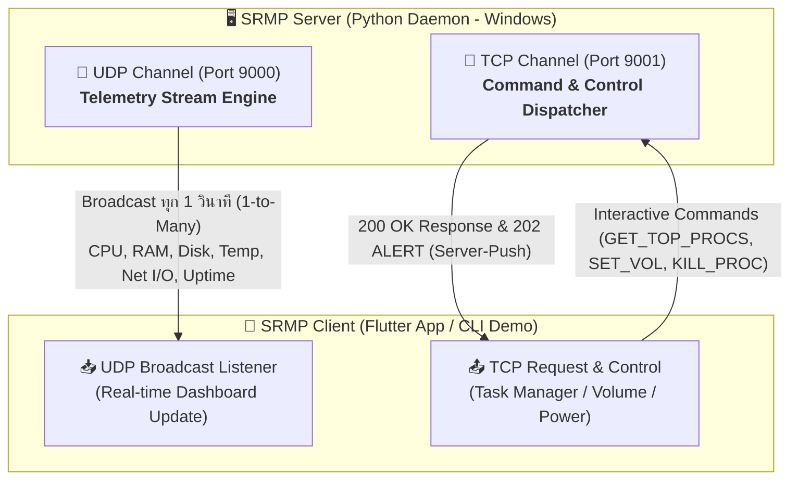

# 🚀 SRMP Monitor — System Resource Monitoring Protocol (v1.0)
---
ชื่อ ทนุธรรม ปี่แก้ว

รหัส 6710450899

video link: https://youtu.be/xg-A95USGGc
---
[](https://www.python.org/)
[](https://flutter.dev/)
[](https://dart.dev/)
[](https://github.com/)
[](./NetworkProject2/srmp_protocol_report.html)

**SRMP Monitor** เป็นโปรแกรมประยุกต์บนระบบเครือข่าย (**Network Application**) ประเภท **Real-Time Remote System Resource Monitoring & Management System** ตามสถาปัตยกรรมแบบ Client-Server ออกแบบมาสำหรับการติดตามทรัพยากรฮาร์ดแวร์ ตรวจสอบโปรเซส และควบคุมเครื่องคอมพิวเตอร์แม่ข่าย (Host PC) จากระยะไกลผ่านเครือข่าย Local Area Network (LAN / Wi-Fi)

ระบบทำงานบน **Application-Layer Protocol** ที่ออกแบบขึ้นเฉพาะในชื่อ **SRMP (System Resource Monitoring Protocol)** ซึ่งผสมผสานการทำงานของทั้ง **UDP** และ **TCP** (Dual-Channel Architecture) เพื่อให้ได้ประสิทธิภาพความเร็วระดับ Real-time ควบคู่กับความเสถียรและความแม่นยำในการสั่งการ

---

## 📌 สถาปัตยกรรมระบบและโปรโตคอล (System Architecture)

ระบบแบ่งช่องทางการสื่อสารออกเป็น 2 ท่อสัญญาณ (Dual-Channel):



### 1. UDP Channel — Telemetry Streaming (`Port 9000`)
* **วัตถุประสงค์**: ถ่ายทอดข้อมูลสถิติทรัพยากรระบบแบบ Real-time และกระจายสัญญาณ Wake-on-LAN
* **เหตุผลการเลือกใช้ UDP**:
  * **Low Overhead & Minimal Latency**: Header มีขนาดเพียง 8 Bytes ไม่ต้องทำ 3-Way Handshake ก่อนส่ง เหมาะกับข้อมูลสตรีมมิ่งที่ส่งถี่ทุกๆ 1 วินาที
  * **Tolerate Packet Loss**: ข้อมูลสถิติเป็น Time-sensitive Data หากแพ็กเก็ตวินาทีที่แล้วหล่นหาย ไม่จำเป็นต้องส่งซ้ำ (No Retransmission) เพราะแพ็กเก็ตใหม่จะมาแทนที่ทันที
  * **Broadcast (1-to-Many)**: ส่งสัญญาณไปยัง `255.255.255.255` ให้ไคลเอนต์หลายเครื่องรับพร้อมกันได้โดยเซิร์ฟเวอร์ไม่ต้องเปิด Connection ค้างไว้

### 2. TCP Channel — Command & Control (`Port 9001`)
* **วัตถุประสงค์**: ควบคุมการทำงานของระบบ, ดึงรายการ Process, สั่งปิดโปรเซส, ปรับเสียง/ความสว่าง และส่งสัญญาณเตือนฉุกเฉิน
* **เหตุผลการเลือกใช้ TCP**:
  * **Reliability & Guaranteed Delivery**: คำสั่งควบคุมเป็น Critical Operations (เช่น `KILL_PROC`, `SYS_POWER`) จึงต้องรับประกันว่าข้อมูลถึงปลายทางครบถ้วน 100% (ACK & Retransmission)
  * **In-Order Delivery**: ตรวจสอบและเรียงลำดับคำสั่ง-คำตอบได้อย่างถูกต้อง
  * **Server-Push Alert**: ช่องทางเชื่อมต่อแบบ Persistent Socket เปิดโอกาสให้เซิร์ฟเวอร์ยิงข้อความเตือนฉุกเฉิน (`202 ALERT`) กลับมายังไคลเอนต์ได้ทันที

---

## 📜 ข้อกำหนดโปรโตคอล SRMP (Protocol Specification)

### 📡 1. UDP Datagram Format (Server ➔ Client Broadcast)
Server กระจายข้อมูลทุก 1.0 วินาที ในรูปแบบ Plain-Text Key-Value:
```text
METRIC cpu=<CPU%> ram=<RAM%> disk=<DISK%> temp_cpu=<TEMP_C> temp_gpu=<TEMP_C> net_up=<MB/s> net_down=<MB/s> net_online=<0|1> net_ping=<MS> uptime=<SECS>
```
**ตัวอย่าง Packet จริง:**
```text
METRIC cpu=24.5% ram=68.2% disk=45.0% temp_cpu=58.5C temp_gpu=46.0C net_up=0.12MB/s net_down=1.45MB/s net_online=1 net_ping=18ms uptime=43200s
```

---

### 🔌 2. TCP Command & Response Format (Client ⬌ Server)

#### ไวยากรณ์ของข้อความ (Syntax)
* **Request (Client ➔ Server):** `<COMMAND_VERB> [key1=value1] [key2=value2]...\n`
* **Response (Server ➔ Client):** `<STATUS_CODE> <STATUS_PHRASE> - <BODY>\n`

#### ตารางคำสั่งที่รองรับ (Command Reference Table)

| หมวดหมู่ | Request Command | Response Body ตัวอย่าง | รายละเอียด |
| :--- | :--- | :--- | :--- |
| **Process List** | `GET_TOP_PROCS limit=8 sortby=CPU` | `200 OK - procs=[{pid:1240,name:chrome.exe,cpu:15.2%,ram:8.4%,ram_mb:1344.2MB},...]` | ดึงรายชื่อ Process สูงสุด (เรียงตาม CPU/RAM) |
| **Kill Process** | `KILL_PROC pid=1240` | `200 OK - PROC_KILLED`<br>`404 NOT_FOUND` | สั่งยุติโปรเซสเป้าหมายตาม PID |
| **Get Setting** | `GET_SETTING name=volume`<br>`GET_SETTING name=brightness` | `200 OK - SETTING_VALUE name=volume value=65` | อ่านค่าระดับเสียงหรือความสว่างปัจจุบัน |
| **Set Volume** | `SET_VOL level=75` | `200 OK - VOLUME_SET_75` | ปรับระดับเสียง Master Volume (0-100%) |
| **Set Brightness**| `SET_BRIGHTNESS level=80` | `200 OK - BRIGHTNESS_SET_80` | ปรับระดับความสว่างหน้าจอ (0-100%) |
| **Power Control** | `SYS_POWER action=LOCK`<br>`SYS_POWER action=RESTART`<br>`SYS_POWER action=SHUTDOWN` | `200 OK - SYSTEM_LOCKED`<br>`200 OK - SYSTEM_RESTARTING`<br>`200 OK - SYSTEM_SHUTDOWN` | ล็อกหน้าจอ, รีสตาร์ท หรือปิดเครื่องคอมพิวเตอร์ |
| **Server Alert** | *(ส่งอัตโนมัติจาก Server)* | `202 ALERT - CPU Temperature exceeded 85C threshold` | การแจ้งเตือนฉุกเฉินแบบ Server-Push |

#### รหัสสถานะ (Status Codes)
* `200 OK` : คำสั่งทำงานสำเร็จ
* `202 ALERT` : ข้อความแจ้งเตือนด่วนจากเซิร์ฟเวอร์ (Asynchronous Server-Push)
* `400 BAD_REQUEST` : ไวยากรณ์หรือพารามิเตอร์ไม่ถูกต้อง (เช่น ค่าเกินขอบเขต 0-100)
* `404 NOT_FOUND` : ไม่พบ Process ID หรือ Setting Name ที่ระบุ
* `500 INTERNAL_ERROR` : เกิดข้อผิดพลาดภายในฝั่ง Server OS API

---

## ✨ ฟีเจอร์หลัก (Key Features)

1. **Real-Time Telemetry Dashboard**:
   * แสดงอัตราการใช้งาน CPU %, RAM %, Disk Storage %
   * อุณหภูมิ CPU (°C) และ GPU (°C)
   * สปีดเครือข่าย Upload / Download (MB/s), สถานะ Online, และ Ping Latency (ms)
   * ระยะเวลาการเปิดเครื่อง (System Uptime)
2. **Multi-layer Hardware Sensor Fallback**:
   * ดึงค่าอุณหภูมิ CPU ผ่านไดรเวอร์ Ring-0 ของ **LibreHardwareMonitor (.NET DLL)**
   * Fallback อัตโนมัติ: LibreHardwareMonitor ➔ WMI ➔ psutil ➔ Dynamic CPU Thermal Load Modeling
3. **Remote Task Manager**:
   * แสดงรายชื่อ Processes ที่ใช้ทรัพยากรสูงสุด
   * สลับการเรียงลำดับตามการใช้งาน CPU % หรือ RAM (MB)
   * ค้นหาและสั่ง **Kill Process** ได้ทันที
4. **Hardware Quick Controls**:
   * ปรับระดับเสียงหลัก (Master Volume 0-100%) ผ่าน Windows Core Audio API (`pycaw`)
   * ปรับระดับความสว่างจอภาพ (Screen Brightness 0-100%) ผ่าน WMI / CIM Instance
5. **System Security & Power**:
   * คำสั่งล็อกหน้าจอคอมพิวเตอร์ทันที (Lock Workstation)
   * คำสั่งสั่งรีสตาร์ท (Restart) หรือปิดเครื่อง (Shutdown)
6. **Wake-on-LAN (WOL)**:
   * รองรับการส่ง UDP Magic Packet ไปยัง MAC Address ของเครื่องเป้าหมายเพื่อเปิดเครื่องจากระยะไกล

---

## 📁 โครงสร้างโปรเจกต์ (Project Structure)

```text
NetworkProject/
├── NetworkProject2/
│   ├── server/                                # 🐍 Python Backend Server
│   │   ├── lhm/LibreHardwareMonitor/          # LibreHardwareMonitor DLLs (Hardware Sensor Driver)
│   │   ├── requirements.txt                   # รายการ Python dependencies (psutil, pycaw, wmi, pythonnet)
│   │   ├── srmp_server.py                     # เซิร์ฟเวอร์หลัก (UDP Broadcast + TCP Daemon)
│   │   └── start_server.bat                   # สคริปต์เปิด Server พร้อม Auto-Venv และสิทธิ์ Admin
│   │
│   ├── flutter_app/                           # 📱 Cross-platform Client Dashboard
│   │   ├── lib/
│   │   │   ├── models/                        # Data Models (MetricData, ProcessInfo)
│   │   │   ├── providers/                     # State Management (MetricProvider)
│   │   │   ├── screens/                       # หน้าจอแสดงผล (ConnectScreen, DashboardScreen)
│   │   │   ├── services/                      # เครือข่าย (UdpService, TcpService)
│   │   │   ├── widgets/                       # UI Components (Gauge, StatCard, ProcessCard)
│   │   │   └── main.dart                      # จุดเริ่มต้นของแอปพลิเคชัน
│   │   └── pubspec.yaml                       # การตั้งค่าและ Dependencies ของ Flutter
│   │
│   ├── srmp_demo_client.py                    # 💻 CLI Interactive Test Client
│   ├── srmp_demo_server.py                    # 🧪 Standalone Mock Server
│   ├── srmp_protocol_report.html              # 📄 รายงานข้อเสนอการพัฒนาโปรโตคอล SRMP (HTML)
│   ├── NetworkProject2_SRMP_Protocol_Report.pdf # 📑 รายงานวิชาการฉบับสมบูรณ์ (PDF)
│   └── generate_pdf.py                        # สคริปต์แปลงรายงาน HTML เป็น PDF
└── README.md
```

---

## 🛠️ วิธีการติดตั้งและเริ่มใช้งาน (Getting Started)

### 1. ข้อกำหนดของระบบ (Prerequisites)
* **เครื่อง Server (Host PC)**:
  * Windows 10 หรือ Windows 11
  * Python 3.10 ขึ้นไป (ติดตั้งและเลือก `Add Python to PATH`)
* **เครื่อง Client (Dashboard)**:
  * Flutter SDK 3.x+ หรืออุปกรณ์ Android / Windows Desktop

---

### 2. วิธีการรัน SRMP Server (ฝั่งเครื่องคอมพิวเตอร์ที่ต้องการ Monitor)

#### วิธีที่ 1: รันผ่านตัวเรียกอัตโนมัติ (แนะนำ)
1. ไปที่โฟลเดอร์ `NetworkProject2/server/`
2. ดับเบิลคลิกไฟล์ **`start_server.bat`** (หรือคลิกขวาแล้วเลือก *Run as administrator*)
   * *สคริปต์จะสร้าง Virtual Environment `.venv` และติดตั้ง Dependencies ให้โดยอัตโนมัติ พร้อมทั้งขอสิทธิ์ Administrator เพื่อให้อ่านค่า Sensor อุณหภูมิ CPU ได้แม่นยำ*

#### วิธีที่ 2: รันผ่าน Command Prompt / Terminal ด้วยตนเอง
```bash
# 1. เข้าสู่โฟลเดอร์เซิร์ฟเวอร์
cd NetworkProject2/server

# 2. สร้างและเปิดใช้งาน Virtual Environment
python -m venv .venv
.venv\Scripts\activate

# 3. ติดตั้ง Dependencies
pip install -r requirements.txt

# 4. รันเซิร์ฟเวอร์
python srmp_server.py
```

---

### 3. วิธีการรัน Client Dashboard (ฝั่งเครื่องผู้ใช้งาน)

#### ก. รันแอปพลิเคชัน Flutter (GUI App)
```bash
# เข้าสู่โฟลเดอร์ Flutter App
cd NetworkProject2/flutter_app

# ติดตั้งแพ็กเกจ
flutter pub get

# รันแอปพลิเคชัน (บน Windows Desktop หรือ Android Device)
flutter run
```
* เมื่อเปิดแอปพลิเคชัน ให้ระบุ **IP Address ของเครื่อง Server** แล้วกด **Connect**

#### ข. รัน CLI Interactive Demo Client (สำหรับการทดสอบใน Terminal)
```bash
# เข้าสู่โฟลเดอร์ NetworkProject2
cd NetworkProject2

# รัน Client เชื่อมต่อไปยัง Localhost หรือ IP ของเครื่องแม่ข่าย
python srmp_demo_client.py 127.0.0.1
```

---

## 🔧 การแก้ไขปัญหาเบื้องต้น (Troubleshooting)

| ปัญหา | สาเหตุที่พบบ่อย | แนวทางแก้ไข |
| :--- | :--- | :--- |
| **ค่าอุณหภูมิ CPU แสดงเป็น 0.0°C หรือเป็นค่าประมาณ** | ไม่ได้เปิดโปรแกรมด้วยสิทธิ์ Administrator | ปิด Server แล้วเปิดใหม่ด้วยการคลิกขวาที่ `start_server.bat` และเลือก **Run as administrator** เพื่อให้ระบบเข้าถึง Ring-0 Kernel Driver ของฮาร์ดแวร์ได้ |
| **Client ไม่ได้รับข้อมูลสตรีมมิ่ง (UDP)** | Windows Firewall บล็อกพอร์ต 9000 | เข้าไปที่ *Windows Defender Firewall* และอนุญาต Inbound Rules สำหรับ **UDP Port 9000** และ **TCP Port 9001** |
| **Error: Address already in use (Port 9001)** | มี Server ตัวเดิมค้างอยู่ใน Background Process | รันผ่าน `start_server.bat` (จะทำการเคลียร์พอร์ตให้อัตโนมัติ) หรือใช้คำสั่ง `taskkill /F /IM python.exe` ใน cmd |

---

## 👥 ข้อมูลโครงการ (Project Information)

* **วิชา:** เครือข่ายคอมพิวเตอร์ (Computer Networks)
* **หัวข้อ:** การพัฒนาโปรแกรม Network Application และการออกแบบ Application-Layer Protocol (SRMP)
* **เอกสารอ้างอิงและรายงานฉบับเต็ม:** [NetworkProject2_SRMP_Protocol_Report.pdf](./NetworkProject2/NetworkProject2_SRMP_Protocol_Report.pdf)
